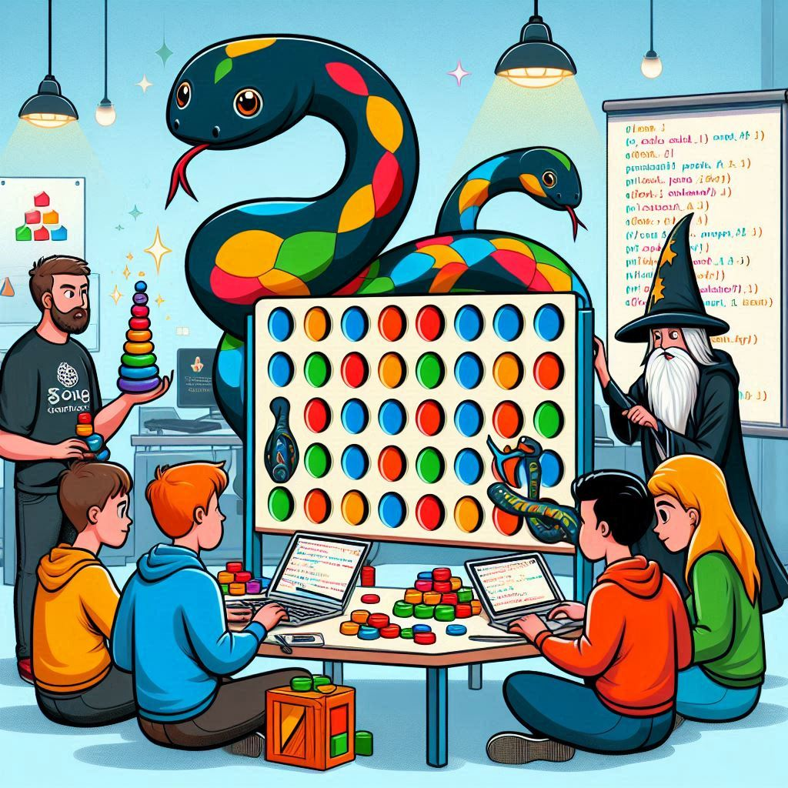

# Event Sourcing Tutorial



In this tutorial, you will implement parts of the backend of a "Connect Four"
game using the architectural design pattern "Event Sourcing".

The tutorial introduces Event Sourcing *from the ground up*, meaning that you
will implement the core building blocks yourself. From there, the step to using
an existing packages that implements those building blocks for you, like the
[`eventsourcing`][package-eventsourcing] package for Python, should be
relatively small.

This is a deliberate choice, as we feel that seeing and implementing those core
building blocks helps with getting a grasp on Event Sourcing. While abstractions
are very nice, by their very nature they hide the underlying implementation
details that are so informative while learning those core concepts.

[package-eventsourcing]: https://eventsourcing.readthedocs.io/en/stable/index.html

---

## Setting Up Your Environment

### Prerequisites

Please make sure that you have the following tools available on your system
prior to joining the tutorial:

- [Python 3.12.x][install-python]
- [Poetry][install-poetry]
- [Docker][install-docker] [^1]

[install-python]: https://www.python.org/downloads/
[install-poetry]: https://python-poetry.org/docs/#installation
[install-docker]: https://docs.docker.com/get-docker/

[^1]: The free-of-cost educational license of Docker Desktop is sufficient this
tutorial. Other container runtimes than the docker runtime may work for you, but
we haven't tested it.

### Installing Dependencies

The application uses Poetry as a package management tool. Run this command to
install and synchronise the dependencies:

```shell
poetry install --only main --sync
```

<details>
  <summary><i>Additonal `poetry` commands</i></summary>
  
> - Run `poetry shell` to spawn a shell with the virtual environment activated
> - Run `poetry run python` to open a Python REPL within the virtual environment
> - Run `poetry run pytest` to run all the tests
> - Run `poetry run python -m connect_four.cli` to play "Connect Four" with a CLI
>   client. Note that the client uses your implementation, so it will only do
>   something interesting (e.g. "not crashing") after you've actually implemented
>   something!
> 
> Note: If you spawned a shell with `poetry shell`, you may omit the `poetry run`
> from the commands listed above.
</details>


### Running EventstoreDB

> [!IMPORTANT]
> **If you are using Apple Silicon or another ARM64-platform**, please see the
> section "EventstoreDB on Apple Silicon/ARM64" below.

You can run EventStoreDB on your local machine using Docker. We've provided a
[Docker Compose][compose-file] file with the settings we will use during this
tutorial.

Run this command to start the service:
```shell
docker compose up eventstoredb  # see notes for Apple Silicon/ARM64 below
```

*If you can't or don't want to use Docker Compose, you can also run the image
directly using the CLI of your container runtime (provided that you pass similar
arguments to the run-command). This is left as an exercise for the Open Source
and FOSS adventurers.*

:point_right: Go to http://localhost:2113/ to view the EventstoreDB web interface. :point_left:

### EventstoreDB on Apple Silicon/ARM64

EventStoreDB provides a separate, experimental image with support for Apple
Silicon and other ARM64 platforms. We've tested this image ourselves and it
works well for this tutorial. We don't know how well it holds up with production
workloads.

We've defined a separate service in the [compose file][compose-file] that uses
this image but is otherwise identical to the regular service.

Run this command to use it:

```shell
docker compose up eventstoredb-arm64
```

[compose-file]: compose.yaml

---

## Exercises

You can find the exercises in the `/exercises`-directory:

- [Exercise 1: Start Game][exercise-01]
- [Exercise 2: Play the game][exercise-02]
- [Exercise 3: Persist the events][exercise-03]

[exercise-01]: /exercises/exercise-01-start-game.md
[exercise-02]: /exercises/exercise-02-play-the-game.md
[exercise-03]: /exercises/exercise-03-persist-the-events.md
